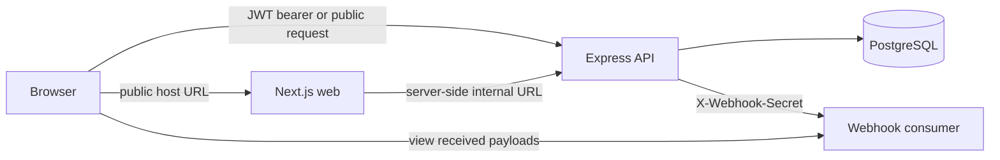

# Creator Support PH Technical Assessment

This application was developed as a technical assessment for Creator Support PH, inspired by Google Forms. It allows authenticated creators to build, customize, and publish forms, review submitted responses, export response data to XLSX, and configure response webhooks. Once a form is published, anyone with its shareable URL can submit a response without needing to sign in. The application also includes a separate webhook consumer website that receives and displays webhook payloads through a lightweight, minimal HTML, CSS, and JavaScript interface.

## Features

- JWT registration and login
- Owner-scoped form, question, response, export, and webhook management
- Draft and published form states with public slug URLs
- Eight question types with server-side answer validation
- Required respondent email collection with repeat submissions allowed
- Historical answer snapshots that survive question edits and soft deletion
- Response list and individual response views
- Server-generated XLSX exports
- Fire-and-forget webhook delivery with attempt logging
- Separate in-memory webhook consumer for end-to-end verification
- Optional, repeatable seed data through a Docker Compose profile

## Technology

| Layer | Technology |
| --- | --- |
| API | Express 5, TypeScript, Zod, pg, Pino |
| Web | Next.js 16, React 19, TypeScript, Tailwind CSS |
| Database | PostgreSQL 17 |
| Authentication | JWT bearer tokens and bcrypt password hashing |
| Spreadsheet export | SheetJS, xlsx |
| Local infrastructure | Docker Compose |
| Webhook consumer | Node.js HTTP server with in-memory storage |

## Project structure

```text
.
├── apps
│   ├── api
│   │   ├── app
│   │   │   ├── config       # Environment and PostgreSQL configuration
│   │   │   ├── middleware   # JWT verification
│   │   │   ├── routes       # Auth, form, question, response, and webhook routes
│   │   │   ├── types
│   │   │   └── utils        # Validation, logging, and webhook delivery
│   │   └── db
│   │       ├── schema.sql
│   │       └── seed.sql
│   ├── web
│   │   ├── app              # Next.js routes and layouts
│   │   ├── components
│   │   ├── lib              # Authentication and API clients
│   │   ├── types
│   │   └── utils
│   └── webhook-consumer
│       └── server.js
├── .env.example
├── docker-compose.yml
└── README.md
```

## Architecture



The browser and Docker containers intentionally use different hostnames. A browser can resolve `localhost`, but it cannot resolve Docker service names. A container can resolve `api` and `webhook-consumer`, while its own `localhost` refers to itself.

| Purpose | Docker value | Native-local value |
| --- | --- | --- |
| Next.js server to API (`APP_API_URL`) | `http://api:5000` | `http://localhost:5000` |
| Browser to API (`NEXT_PUBLIC_APP_API_URL`) | `http://localhost:5000` | `http://localhost:5000` |
| API to webhook consumer (`SEED_WEBHOOK_URL`) | `http://webhook-consumer:4000/webhook` | `http://localhost:4000/webhook` |
| Browser to webhook consumer | `http://localhost:4000` | `http://localhost:4000` |

These URLs are routing configuration, not credentials. Any variable prefixed with `NEXT_PUBLIC_` is bundled into browser code by Next.js and must never contain a secret.

## Environment configuration

Copy the tracked template before starting the application:

```bash
cp .env.example .env
```

Replace the placeholder passwords and secrets. For example:

```bash
openssl rand -hex 32
```

| Variable | Used by | Purpose | Secret |
| --- | --- | --- | --- |
| `DB_HOST` | API and database scripts | PostgreSQL hostname; Compose overrides it to `db` | No |
| `DB_PORT` | API and database scripts | PostgreSQL port | No |
| `DB_NAME` | PostgreSQL, API, seed | Database name | No |
| `DB_USER` | PostgreSQL, API, seed | Database user | No |
| `DB_PASS` | PostgreSQL, API, seed | Database password | Yes |
| `API_PORT` | API and Compose | Express listen and host port | No |
| `CORS_ORIGIN` | API | Exact browser origin allowed by CORS | No |
| `JWT_SECRET` | API | Signs and verifies authentication tokens | Yes |
| `WEB_PORT` | Compose | Host port for Next.js | No |
| `APP_API_URL` | Next.js server | API base URL used during server rendering | No |
| `NEXT_PUBLIC_APP_API_URL` | Browser | Public API base URL bundled into the web client | No |
| `WEBHOOK_CONSUMER_PORT` | Consumer and Compose | Consumer listen and host port | No |
| `WEBHOOK_SECRET` | Seed and consumer | Verifies seeded webhook deliveries | Yes |
| `SEED_WEBHOOK_URL` | Seed and web | Endpoint stored on the seeded form and prefilled for new webhook configurations | No |

The API validates required configuration when it starts. Web API clients also throw a clear configuration error when their applicable API URL is missing. The untracked `.env` remains local; `.env.example` contains only safe placeholders and may be committed.

Keep related values aligned when changing ports: `API_PORT` must match the port in both API URL variables, while `WEB_PORT` must match `CORS_ORIGIN`. `WEBHOOK_CONSUMER_PORT` must match the port in `SEED_WEBHOOK_URL`.

## Docker Compose setup

Prerequisites:

- Docker Engine with Docker Compose

From the repository root:

```bash
cp .env.example .env
# Edit .env and replace DB_PASS, JWT_SECRET, and WEBHOOK_SECRET.
docker compose up --build -d
```

Open:

- Forms app: `http://localhost:3000`
- API: `http://localhost:5000`
- Webhook consumer: `http://localhost:4000`

Inspect service status and logs with:

```bash
docker compose ps
docker compose logs -f api web webhook-consumer
```

Stop the stack while retaining PostgreSQL data:

```bash
docker compose down
```

`docker compose down -v` also removes the database volume and all stored application data.

## Seed data

Seeding is opt-in. Normal `docker compose up` does not modify application data.

Run the one-shot seed service against a new or running Compose database:

```bash
docker compose --profile seed run --rm seed
```

Alternatively, start the stack and include the seed profile in one command:

```bash
docker compose --profile seed up --build -d
```

The transactional seed uses stable IDs and upserts, so it can be run repeatedly without producing duplicates. It creates two users, four forms across those users, published and draft forms, all eight question types, four responses, answer snapshots, and one configured webhook.

Seed accounts:

| Email | Password |
| --- | --- |
| `alex.seed@forms-app.test` | `SeedPass1!` |
| `sam.seed@forms-app.test` | `SeedPass1!` |

The published all-question-types form is available at `http://localhost:3000/f/seed-creator-onboarding`.

## Native setup without Docker

Prerequisites:

- Node.js 22 or newer
- npm
- PostgreSQL 17 or a compatible recent PostgreSQL version
- `psql` available on `PATH`

1. Copy `.env.example` to `.env` and replace its secrets.
2. Change `APP_API_URL` to `http://localhost:5000`.
3. Change `SEED_WEBHOOK_URL` to `http://localhost:4000/webhook`.
4. Create the PostgreSQL user and database named by `DB_USER` and `DB_NAME`, and grant that user ownership or schema creation privileges.
5. Install dependencies:

```bash
npm --prefix apps/api ci
npm --prefix apps/web ci
```

The webhook consumer has no external packages, so it does not require installation.

Load `.env` into the shell for the `psql` scripts, then create and optionally seed the schema:

```bash
set -a
source .env
set +a
npm --prefix apps/api run db:schema
npm --prefix apps/api run db:seed
```

Run each application in a separate terminal from the repository root:

```bash
npm --prefix apps/api run dev
```

```bash
npm --prefix apps/web run dev
```

```bash
npm --prefix apps/webhook-consumer run dev
```

The API, Next.js configuration, and webhook consumer load the repository-level `.env` for native development. Process-level environment variables take precedence, which keeps the same code usable in Compose or another deployment environment.

## Authentication and authorization

Registration hashes passwords with bcrypt. Login returns a JWT containing the user ID in `sub` and the email as an additional claim; tokens expire after one day. Protected clients pass the token through `Authorization: Bearer <token>`.

All form-management routers verify the JWT. Database queries for forms, questions, responses, XLSX exports, webhook settings, and delivery logs include the authenticated owner ID. Public form retrieval and submission are unauthenticated but require the form to be published. Submission checks publication again during persistence so an unpublished form cannot accept a late response.

## Technical decisions and trade-offs

### Relational core with JSONB at the variable edges

Forms, questions, responses, answers, webhooks, and delivery attempts are separate relational tables with foreign keys and indexes around their ownership and common access paths. Question-type-specific configuration and submitted values use JSONB because their shapes vary: an option question stores an array of choices, a linear scale stores bounds and labels, and an answer may be a string, number, array, or `null`.

This keeps ownership, ordering, and response relationships queryable without creating a table for every question type. The trade-off is that PostgreSQL cannot express every type-specific rule as a simple column constraint, so Zod schemas and API validation enforce configuration shape, required answers, option membership, date format, text limits, and scale bounds before data is written.

### Historical responses use answer snapshots

The application does not maintain a versioned copy of the entire form. Instead, each submitted answer snapshots the question ID, label, type, order, configuration, and value as they existed at submission time. A snapshot is written for every question, including optional questions left unanswered. Current questions are edited in place and soft-deleted with `question_deleted_at`; the answer-to-question foreign key is nullable and uses `ON DELETE SET NULL` as an additional safeguard, while the snapshot remains self-contained.

This was chosen over a form-version table because the required historical read path is direct: an individual response can be rendered entirely from its answer rows and is unaffected by later question edits, reordering, or deletion. The trade-off is that the application cannot reconstruct, compare, or restore complete historical form versions. That would be the point at which explicit `form_versions` and versioned question definitions become worthwhile.

### Authorization is enforced at the data boundary

The web app uses a one-day JWT in a `SameSite=Lax` cookie and sends it to protected API routes as a bearer token. The Next.js middleware provides navigation-level redirects, but it is not treated as the security boundary. The Express middleware verifies the JWT, and protected SQL queries also include the authenticated owner ID so possession of another form or response ID does not grant access.

For a production system, I would move token issuance behind a same-origin backend-for-frontend and use `HttpOnly`, `Secure` cookies with a refresh/revocation strategy. The browser-readable cookie used here keeps the assessment's separate Next.js and Express applications simple, but it is not the session design I would choose for a production deployment.

### Submission and webhook delivery have separate outcomes

Response persistence is atomic: the response and its answer snapshots are inserted together, with publication checked again in the write query. Only after that succeeds does the API start webhook delivery. The webhook has a ten-second timeout, and its result is recorded separately, so a slow or unavailable consumer cannot roll back or fail a valid respondent submission. Retries and a durable job queue were intentionally omitted because the specification does not require them; in production, an outbox-backed worker would provide stronger delivery guarantees.

## Known requirement deviation

The specification asks for the owner's response overview to be a table of all submissions. The implemented overview is instead a list of submissions showing respondent email and submission time, with a link to open each response in full.

This is a deliberate presentation trade-off. Because questions can be edited, added, reordered, or deleted between submissions, respondents to the same form can have different effective question revisions. A single on-screen table would either mix those revisions under ambiguous columns or become very wide and sparse. The per-response detail view preserves the exact snapshotted labels and ordering for that submission. The XLSX export is the tabular workflow: it produces one row per response, includes columns for the form's question IDs (including soft-deleted questions), and leaves cells blank when a response predates or did not answer a question.

## Data model

| Table | Responsibility |
| --- | --- |
| `users` | Creator identity, email, and password hash |
| `forms` | Owner, title, description, public slug, and publication state |
| `questions` | Ordered question definition, required flag, type, and JSONB configuration |
| `responses` | Form, respondent email, and submission timestamp |
| `answers` | Per-response question and value snapshot |
| `webhooks` | One configurable endpoint and secret per form |
| `webhook_deliveries` | Delivery timestamp, HTTP status, and error details |

Foreign keys cascade when a form or response is deleted. Questions are soft-deleted so historical relationships remain available. Frequently queried ownership, response-order, answer-order, and delivery-order paths have indexes.

### Question representation

Question types are stored as numeric IDs, while type-specific settings live in `question_config` JSONB:

| ID | Type | Configuration | Answer |
| --- | --- | --- | --- |
| 1 | Short text | `{}` | String, up to 255 characters |
| 2 | Long text | `{}` | String, up to 5,000 characters |
| 3 | Date | `{}` | ISO date string |
| 4 | Dropdown | `{ "options": [...] }` | One configured option |
| 5 | Multi-select dropdown | `{ "options": [...] }` | Zero or more configured options |
| 6 | Multiple choice | `{ "options": [...] }` | One configured option |
| 7 | Checkboxes | `{ "options": [...] }` | Zero or more configured options |
| 8 | Linear scale | `{ "min", "max", "minLabel", "maxLabel" }` | Integer within the configured range |

The API validates required answers, option membership, date format, text limits, and linear-scale bounds before writing a response.

## Responses and XLSX export

Owners can view every submission for a form and open an individual response. Each response records the required respondent email, submission timestamp, and one answer snapshot per question. The same email may submit the same form any number of times.

The owner-only export endpoint creates an `.xlsx` file server-side with one row per response. Columns begin with `email` and `submitted-at`, followed by questions in order. Multi-select and checkbox arrays are joined into a comma-separated cell value.

## Webhooks

A webhook is generated by a successful public form submission; saving the webhook configuration itself does not send a test event. The API commits the response first, then starts a non-blocking HTTP `POST` to the configured endpoint with a ten-second timeout. It sends the configured secret in `X-Webhook-Secret`. Webhook failure never changes a successful respondent submission, and retries are intentionally not implemented.

### Configure and verify the included consumer

The consumer is already started by `docker compose up` and runs at `http://localhost:4000` from the host. To exercise the full flow:

1. In `.env`, set `WEBHOOK_SECRET` to the secret the consumer should accept, then start the stack. If the consumer was already running when the value changed, recreate its container so it receives the new environment.
2. Log in at `http://localhost:3000`, create or open a form, and select its **Webhook** tab.
3. Enter the URL and secret shown below, then select **Save configuration**.

   ```text
   Docker Compose
   URL:    http://webhook-consumer:4000/webhook
   Secret: the exact value of WEBHOOK_SECRET in .env

   Fully native execution
   URL:    http://localhost:4000/webhook
   Secret: the exact value of WEBHOOK_SECRET in .env
   ```

   Under Compose, `localhost` is not the correct saved URL: webhook delivery originates inside the API container, where `localhost` refers to that container. The Docker service name `webhook-consumer` routes the request to the consumer. The host URL is used only to view the consumer in a browser.
4. In the form header, select **Publish**, then **View form**. Fill in the required email and questions and submit the public form. Every successful submission creates an independent response and triggers one webhook attempt when the webhook is enabled.
5. Open `http://localhost:4000` to see the received JSON payload. The page refreshes every five seconds and stores accepted payloads only in memory, so restarting the consumer clears the list.
6. Return to the form's **Webhook** tab and refresh the page to inspect **Delivery log**. HTTP `200` means the included consumer accepted the payload. HTTP `401` usually means the saved form secret does not match `WEBHOOK_SECRET`; **Failed** with no status generally means the URL was unreachable or timed out. The log records the consumer's HTTP response status, not a second form response.

The **Enable webhook deliveries** switch stops new deliveries without deleting the URL, secret, or existing log. After a webhook has been saved, leaving the secret field empty while saving another URL keeps the existing secret; entering a value replaces it.

If the optional seed was run, the seeded published form is already pointed at the Compose consumer URL. Its saved secret is the `WEBHOOK_SECRET` value that was passed to the seed command.

### Delivery and consumer behavior

The consumer accepts `POST /webhook`, verifies `X-Webhook-Secret`, returns `401` for a missing or incorrect secret, and returns `200` after storing valid JSON. It renders accepted payloads at `GET /`; `GET /health` provides a basic health response. Delivery attempts are stored in PostgreSQL with their timestamp, status code, and error message, while received consumer payloads are intentionally in-memory only.

### Payload contract

```json
{
  "form": {
    "id": "form-id",
    "title": "Creator Onboarding Survey"
  },
  "response": {
    "id": "response-id",
    "email": "respondent@example.com",
    "submittedAt": "2026-09-03T04:21:00.000Z",
    "answers": [
      {
        "questionId": "question-id",
        "label": "Primary role",
        "type": "dropdown",
        "value": "Creator"
      },
      {
        "questionId": "question-id-2",
        "label": "Tools you use",
        "type": "multi_select",
        "value": ["Canva", "Figma"]
      }
    ]
  }
}
```

## API route summary

| Method and path | Authentication | Purpose |
| --- | --- | --- |
| `POST /api/auth/register` | Public | Register and receive a JWT |
| `POST /api/auth/login` | Public | Log in and receive a JWT |
| `GET/POST /api/forms` | JWT | List or create owned forms |
| `GET/PATCH/DELETE /api/forms/:formId` | JWT + owner | Read, edit metadata, or delete a form |
| `PATCH /api/forms/:formId/status` | JWT + owner | Publish or unpublish a form |
| `/api/forms/:formId/questions...` | JWT + owner | Create, edit, reorder, and delete questions |
| `GET /api/forms/:formId/responses` | JWT + owner | List responses |
| `GET /api/forms/:formId/responses/:responseId` | JWT + owner | Read one response |
| `GET /api/forms/:formId/responses/export` | JWT + owner | Download XLSX responses |
| `/api/forms/:formId/webhook...` | JWT + owner | Configure webhook and inspect deliveries |
| `GET /api/public/forms/:slug` | Public, published only | Load a public form |
| `POST /api/public/forms/:slug/responses` | Public, published only | Submit a response |

## Useful commands

```bash
# API type check
npm --prefix apps/api exec -- tsc --noEmit

# Web lint and type check
npm --prefix apps/web run lint
npm --prefix apps/web exec -- tsc --noEmit

# Web production build
npm --prefix apps/web run build

# Validate Compose configuration
docker compose config --quiet
```

## Deliberately out of scope

- File-upload questions
- Respondent response editing
- Email notifications
- Conditional logic, branching, or page breaks
- Collaborators and team-shared forms
